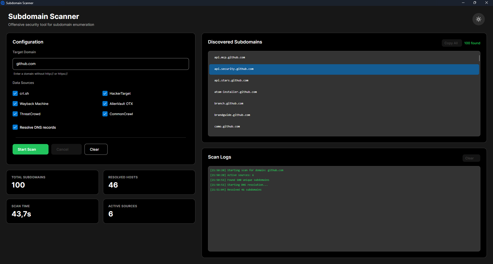

# SubdomainScanner v2.0

Subdomain discovery tool in C# .NET, similar to Sublist3r, with modular architecture and multiple sources.

**Author:** Nicolas ESTEBE / devestebe@gmail.com



## Features

- **Modular architecture** - Easily extensible data sources
- **6 public sources** - crt.sh, HackerTarget, Wayback Machine, AlienVault OTX, ThreatCrowd, CommonCrawl
- **DNS resolution** - Verification of active subdomains with IP addresses
- **Multi-format export** - TXT, JSON, CSV
- **Flexible configuration** - Enable/disable individual sources
- **Asynchronous** - Parallel search across all sources
- **Cross-platform Desktop UI** - Modern Avalonia interface with dark theme
- **Modern Web UI** - Professional Blazor interface
- **Intuitive CLI interface** - With complete help

## Project Architecture

```
SubdomainScanner/
├── SubdomainScanner.Core/           # Core library
│   ├── Core/                        # Core components
│   │   ├── ISubdomainSource.cs      # Interface for sources
│   │   ├── BaseSubdomainSource.cs   # Abstract base class
│   │   └── SubdomainScanner.cs      # Main manager
│   ├── Sources/                     # Source implementations
│   │   ├── CrtShSource.cs
│   │   ├── HackerTargetSource.cs
│   │   ├── WaybackMachineSource.cs
│   │   ├── AlienVaultSource.cs
│   │   ├── ThreatCrowdSource.cs
│   │   └── CommonCrawlSource.cs
│   └── Utils/                       # Utilities
│       └── FileExporter.cs          # File export
├── SubdomainScanner.Console/        # CLI application
│   └── Program.cs                   # CLI entry point
├── SubdomainScanner.Avalonia/       # Desktop UI (Cross-platform)
│   ├── Views/
│   │   ├── MainWindow.axaml         # Main window UI
│   │   └── MainWindow.axaml.cs      # Main window logic
│   ├── ViewModels/
│   │   └── MainWindowViewModel.cs   # MVVM view model
│   ├── Services/
│   │   └── ScannerService.cs        # Scanner business logic
│   └── Styles/
│       └── ModernStyles.axaml       # Nuxt UI inspired theme
├── SubdomainScanner.Blazor/         # Web UI
│   ├── Components/
│   │   ├── Layout/                  # Layout components
│   │   │   ├── MainLayout.razor     # Main layout
│   │   │   ├── NavMenu.razor        # Navigation menu
│   │   │   └── Footer.razor         # Footer
│   │   └── Pages/
│   │       ├── Scanner.razor        # Main scanner page
│   │       └── Home.razor           # Home page (redirects to scanner)
│   ├── Services/
│   │   └── ScannerService.cs        # Scanner business logic
│   └── wwwroot/js/
│       └── fileDownload.js          # File download utilities
```

## Data Sources

| Source | Description | Type |
|--------|-------------|------|
| **crt.sh** | Certificate Transparency Logs | SSL/TLS Certificates |
| **HackerTarget** | Public search API | DNS & Web |
| **Wayback Machine** | Internet Archive | Web history |
| **AlienVault OTX** | Open Threat Exchange | Threat Intelligence |
| **ThreatCrowd** | Domain search | Security |
| **CommonCrawl** | Web crawl index | Web crawling |

## Installation

```bash
cd SubdomainScanner
dotnet build -c Release
```

## Usage

### Desktop Application (Avalonia)

Launch the modern cross-platform desktop interface:

```bash
# Run the Avalonia desktop application
dotnet run --project "SubdomainScanner.Avalonia/SubdomainScanner.Avalonia.csproj"
```

#### Desktop UI Features

- **2-Column Layout** - Configuration on left, Results & Logs always visible on right (no scrolling needed!)
- **Real-time scanning** - Live progress updates with auto-scrolling logs
- **Compact statistics** - 2×2 grid showing total subdomains, resolved hosts, scan time, active sources
- **Interactive configuration** - Enable/disable sources with aligned checkboxes
- **DNS resolution toggle** - Optional IP address resolution
- **Dark/Light theme** - Toggle with animated theme switcher
- **Modern design** - Nuxt UI inspired color scheme (Green #22c55e primary, Slate grays)
- **Smooth animations** - Hover effects, scale transforms, smooth transitions
- **Copy to clipboard** - Native clipboard integration
- **Cross-platform** - Runs on Windows, macOS, and Linux

### Web Interface

Launch the modern Blazor web interface:

```bash
# Run the web application
dotnet run --project "SubdomainScanner.Blazor/SubdomainScanner.Blazor.csproj"
```

Then open your browser to `https://localhost:5001` (or the URL shown in the console).

#### Web UI Features

- **Real-time scanning** - Live progress updates and logs
- **Statistics dashboard** - Total subdomains, resolved hosts, scan time
- **Interactive configuration** - Enable/disable sources with visual checkboxes
- **DNS resolution toggle** - Optional IP address resolution
- **Multiple export formats** - Download results as TXT, JSON, or CSV
- **Search & filter** - Find specific subdomains in results
- **Dark mode** - Modern dark interface optimized for security professionals
- **Copy to clipboard** - Quick copy of all results

### Command Line Interface

#### Basic Examples

```bash
# Scan a domain with all sources
dotnet run -- -d example.com

# List available sources
dotnet run -- -l

# Scan with DNS resolution
dotnet run -- -d example.com -r

# Export to JSON
dotnet run -- -d example.com -o results.json -f json

# Export to CSV with DNS resolution
dotnet run -- -d example.com -r -o results.csv -f csv

# Disable specific sources
dotnet run -- -d example.com --disable wayback --disable commoncrawl

# Verbose mode
dotnet run -- -d example.com -v
```

#### CLI Options

```
Options:
  -d, --domain <domain>    Target domain to scan (required)
  -o, --output <file>      Save results to a file
  -f, --format <format>    Export format: txt, json, csv (default: txt)
  -r, --resolve            Resolve IP addresses of subdomains
  -v, --verbose            Verbose mode with error details
  --disable <source>       Disable a specific source
  -l, --list-sources       List all available sources
  -h, --help               Display help
```

## Compile to Executable

### Console Application

#### Windows
```bash
dotnet publish SubdomainScanner.Console/SubdomainScanner.Console.csproj -c Release -r win-x64 --self-contained -p:PublishSingleFile=true
```

#### Linux
```bash
dotnet publish SubdomainScanner.Console/SubdomainScanner.Console.csproj -c Release -r linux-x64 --self-contained -p:PublishSingleFile=true
```

#### macOS
```bash
dotnet publish SubdomainScanner.Console/SubdomainScanner.Console.csproj -c Release -r osx-x64 --self-contained -p:PublishSingleFile=true
```

The executable will be in `SubdomainScanner.Console/bin/Release/net9.0/<runtime>/publish/`

### Web Application

To publish the Blazor web application:

```bash
dotnet publish SubdomainScanner.Blazor/SubdomainScanner.Blazor.csproj -c Release
```

The published files will be in `SubdomainScanner.Blazor/bin/Release/net9.0/publish/`

## Output Examples

### TXT Format
```
api.github.com
www.github.com
gist.github.com
```

### JSON Format
```json
{
  "timestamp": "2025-01-15T10:30:00Z",
  "total": 296,
  "subdomains": [
    "api.github.com",
    "www.github.com",
    "gist.github.com"
  ]
}
```

### CSV Format (with -r)
```csv
Subdomain,IP Address
api.github.com,140.82.121.6
www.github.com,140.82.121.4
```

## Add a New Source

1. Create a class in `Sources/` inheriting from `BaseSubdomainSource`
2. Implement `SearchAsync(string domain)`
3. Add the source in `Program.cs`

Example:
```csharp
public class MySource : BaseSubdomainSource
{
    public override string Name => "MySource";

    public MySource(HttpClient httpClient) : base(httpClient) { }

    public override async Task<HashSet<string>> SearchAsync(string domain)
    {
        LogInfo("Searching...");
        // Your logic here
        var results = new HashSet<string>();
        return CleanSubdomains(results, domain);
    }
}
```

## Performance

- Asynchronous parallel search
- Configurable timeout (30s default)
- Automatic result deduplication
- Per-source error handling (one error doesn't stop others)

## Ethical Use

This tool is intended for defensive security purposes only:
- ✅ Authorized penetration testing
- ✅ Security audit of your own domains
- ✅ Cybersecurity research
- ❌ Unauthorized scanning
- ❌ Malicious reconnaissance

**Never use this tool against domains without explicit authorization.**

## License

Educational project - Responsible use only

## Credits

Inspired by Sublist3r - Rewritten in C# with modular architecture
